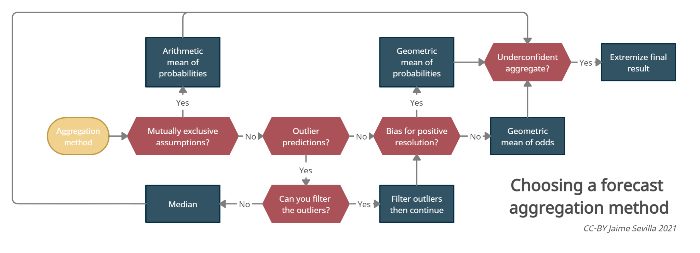

## About



This package contains a series of utilities for forecast aggregation. It is currently in _alpha_, meaning that the code itself works, but there isn't error checking.

For an introduction to different aggregation methods, see Jaime Sevilla's [Aggregation](https://forum.effectivealtruism.org/s/hjiBqAJNKhfJFq7kf) series. For an explanation of the neyman method, see [here](https://forum.effectivealtruism.org/s/hjiBqAJNKhfJFq7kf/p/biL94PKfeHmgHY6qe).

## Built with

- vanilla javascript
- [Best readme template](https://github.com/othneildrew/Best-README-Template)

## Getting started

### Installation

```sh
npm install @forecasting/aggregation
```

### Usage

```js
import {
  median,
  arithmeticMean,
  geometricMean,
  geometricMeanOfOdds,
  extremizedGeometricMeanOfOdds,
  neyman,
} from "@forecasting/aggregation";

let ps = [0.1, 0.2, 0.4, 0.5];
console.log(ps);

console.log(median(ps));
console.log(arithmeticMean(ps));
console.log(geometricMean(ps));
console.log(geometricMeanOfOdds(ps));
console.log(extremizedGeometricMeanOfOdds(ps, 1.5)); // 1.5 is the extremization factor
console.log(extremizedGeometricMeanOfOdds(ps, 2.5));
console.log(neyman(ps));
```

## Roadmap

- [ ] validate probabilities (must be 0<= p <=1)
- [ ] Decide on a return type if probabilities are not validated (-1? / null?)
- [ ] Write wrapper code for validation
- [ ] Validate that array.length > 0
- [ ] add weighting? by recency?
- [ ] filter outliers?
- [ ] Write documentation
- [ ] Do another repository for scoring methods
