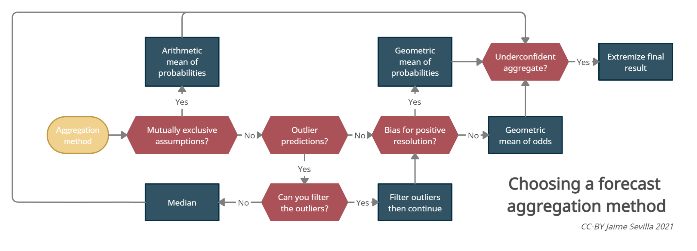

## About



This package contains a series of utilities for forecast aggregation. It is currently in _alpha_, meaning that the code hasn't been tested much.

For an introduction to different aggregation methods, see Jaime Sevilla's [Aggregation](https://forum.effectivealtruism.org/s/hjiBqAJNKhfJFq7kf) series. For an explanation of the neyman method, see [here](https://forum.effectivealtruism.org/s/hjiBqAJNKhfJFq7kf/p/biL94PKfeHmgHY6qe).

## Built with

- vanilla javascript
- [Best readme template](https://github.com/othneildrew/Best-README-Template)
- [lerna](https://github.com/lerna/lerna)

## Getting started

### Installation

```sh
npm install @forecasting/aggregation
```

### Usage

```js
import {
  median,
  arithmeticMean,
  geometricMean,
  geometricMeanOfOdds,
  extremizedGeometricMeanOfOdds,
  neyman,
} from "@forecasting/aggregation";

let ps = [0.1, 0.2, 0.4, 0.5];
console.log(ps);

console.log(median(ps));
console.log(arithmeticMean(ps));
console.log(geometricMean(ps));
console.log(geometricMeanOfOdds(ps));
console.log(extremizedGeometricMeanOfOdds(ps, 1.5)); // 1.5 is the extremization factor
console.log(extremizedGeometricMeanOfOdds(ps, 2.5));
console.log(neyman(ps));

// invalid inputs, will return -1
let notArrayOfProbabilities0 = "Hello world!";
console.log(arithmeticMean(notArrayOfProbabilities0)); // -1
let notArrayOfProbabilities1 = [];
console.log(arithmeticMean(notArrayOfProbabilities1)); // -1
let notArrayOfProbabilities2 = ["a"];
console.log(arithmeticMean(notArrayOfProbabilities2)); // -1
let notArrayOfProbabilities3 = [2, 4, 5];
console.log(arithmeticMean(notArrayOfProbabilities3)); // -1
let notArrayOfProbabilities4 = [0.2, 4, 5];
console.log(arithmeticMean(notArrayOfProbabilities4)); // -1

const chosenAggregationMethod = neyman;
const getAggregatedProbabilities = (array) => {
  let result = neyman(array);
  if (result == -1) {
    // handle case somehow; maybe throw an error, e.g.:
    // throw new Error("Invalid array of probabilities")
  } else {
    return result;
  }
};
```

## Roadmap

- [x] validate probability (must be 0<= p <=1)
- [x] Decide on a return type if probabilities are not validated (-1? / null?)
- [x] Write wrapper code for validation
- [x] Validate that array.length > 0
- [ ] add weighting? by recency?
- [ ] filter outliers?
